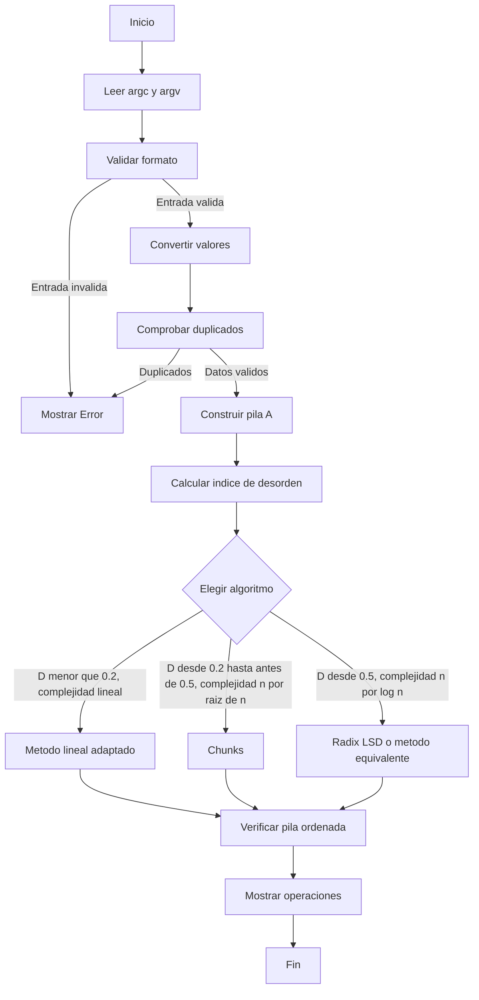
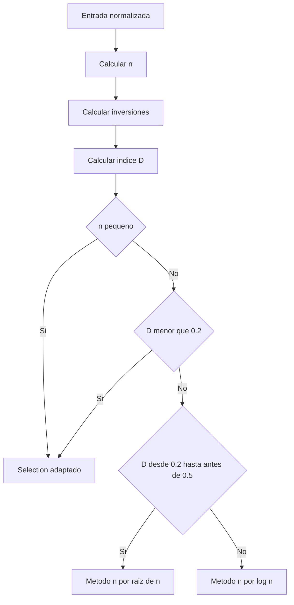
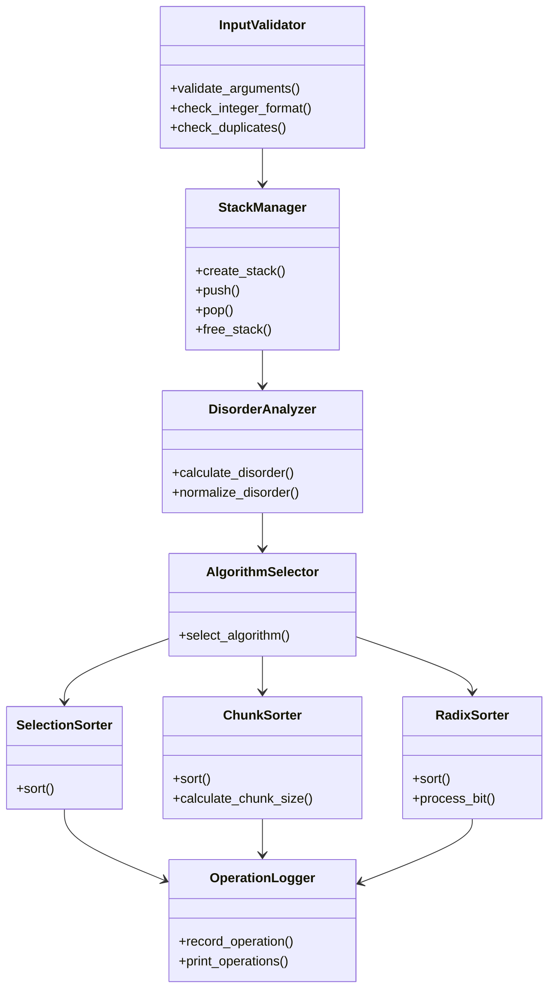
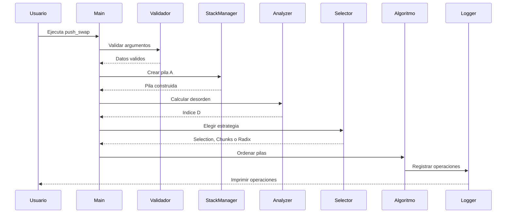

# Diagramacion de push_swap
Este documento recoge la arquitectura inicial y el flujo de decision del
proyecto. Su objetivo es que el grupo tenga una referencia comun antes de
implementar los algoritmos.
## Objetivo general

El programa debe:
1. Leer y validar los argumentos de entrada.
2. Convertir los valores a una representacion util para ordenar.
3. Construir la pila A.
4. Medir el desorden de la entrada.
5. Elegir una estrategia de ordenacion.
6. Generar solo operaciones validas de `push_swap`.
7. Dejar la pila A ordenada y la pila B vacia.
Las estrategias previstas son:

- Selection adaptado: algoritmo sencillo, con complejidad teorica `O(n^2)`.
- Chunks: divide la entrada en aproximadamente `sqrt(n)` chunks.
- Radix LSD: procesa los bits menos significativos, con complejidad habitual
    `O(n * k)`, donde `k` es el numero de bits procesados.
- Selector adaptativo: decide que estrategia utilizar segun el tamano y el
    indice de desorden.
## Conclusiones de diseno

### Flujo comun
Los tres algoritmos deben recibir una entrada ya validada y una estructura de
pilas consistente. La validacion, la gestion de memoria y el registro de
operaciones no deben duplicarse dentro de cada algoritmo.
### Representacion por indices

Conviene transformar los valores originales en indices ordenados antes de
ejecutar `chunks` o `radix`. Esto simplifica las comparaciones y permite que
Radix LSD trabaje con valores no negativos y acotados por `n`.

### Indice de desorden
El indice debe calcularse a partir de la funcion `compute_disorder` que se
esta reescribiendo. La funcion debe contar dos cantidades mediante recorridos
con `while`, sin utilizar `for`:

- `mistakes`: pares de elementos que aparecen fuera de orden.
- `total_pairs`: total de pares comparables.

El indice se obtiene dividiendo los pares fuera de orden entre el total de
pares:

$$
D = \frac{I}{n(n-1)/2}
$$

En la implementacion, `I` corresponde a `mistakes` y el denominador debe ser
`total_pairs`. El valor de `D` esta entre `0` y `1` cuando `n` es mayor que
`1`.

Para una entrada con menos de dos elementos no existen pares que comparar.
Ese caso debe producir un desorden de `0` y evitar la division entre cero.

El recorrido anidado para contar los pares tiene coste `O(n^2)`, aunque se
utilicen `while` en lugar de `for`. Ese coste pertenece al analisis inicial y
debe separarse de la complejidad del algoritmo de ordenacion elegido.

### Decision adaptativa

La decision esta definida por estos intervalos:

- `D menor que 0.2`: desorden bajo. El metodo elegido debe cumplir `O(n)`.
- `D desde 0.2 hasta antes de 0.5`: desorden medio. El metodo elegido debe
    cumplir `O(n sqrt(n))`.
- `D desde 0.5`: desorden alto. El metodo elegido debe cumplir `O(n log n)`.

El grupo debe documentar que algoritmo concreto satisface cada requisito. No
se debe asignar automaticamente Selection, Chunks o Radix solo por el nombre
del intervalo si la implementacion no garantiza la complejidad exigida.

La decision debe producir una estrategia, no modificar directamente las
pilas. De esta forma el selector puede probarse de manera independiente.

### Casos que deben probarse
- Entrada vacia o sin numeros.
- Un solo elemento.
- Dos, tres y cinco elementos.
- Entrada ya ordenada.
- Entrada en orden inverso.
- Valores negativos.
- `INT_MIN` y `INT_MAX`.
- Valores duplicados.
- Argumentos separados y argumentos agrupados en una cadena.
- Entradas aleatorias de tamano creciente.
## Diagrama de actividad general

## Diagrama de decision adaptativa

La etiqueta `Metodo O(n)` representa el algoritmo que el grupo defina para el
desorden bajo. Las etiquetas de los otros niveles expresan el requisito de
complejidad, no sustituyen la decision de implementacion.

## Diagrama de componentes

Los nombres del diagrama representan responsabilidades, no obligan a usar
exactamente esos nombres de funciones o estructuras.

## Diagrama de secuencia adaptativa

## Flujo de Selection adaptado

El grupo debe decidir como se localiza el minimo o el maximo, que pila se usa
como auxiliar y si conviene rotar o invertir antes de mover un elemento.

La complejidad teorica general es:

$$
O(n^2)
$$

Su interes principal es resolver de forma controlada las entradas pequenas.
Solo debe asignarse al nivel `D < 0.2` si la adaptacion implementada puede
justificar el requisito `O(n)` de ese nivel.

## Flujo de Chunks

1. Calcular el numero o el tamano de los chunks.
2. Seleccionar el rango de indices del chunk actual.
3. Mover a B los elementos que pertenecen al rango.
4. Decidir como rotar B para facilitar la reconstruccion.
5. Devolver los elementos a A en orden.
6. Pasar al siguiente chunk.

Si se utilizan aproximadamente `sqrt(n)` chunks, hay que documentar si el
tamano se calcula como `n / sqrt(n)` o si se usa otra formula.

## Flujo de Radix LSD

1. Trabajar con indices no negativos.
2. Empezar por el bit menos significativo.
3. Separar los elementos segun el bit actual.
4. Utilizar las operaciones de las pilas para realizar la separacion.
5. Restaurar los elementos en A.
6. Avanzar al siguiente bit.
7. Repetir hasta procesar todos los bits necesarios.

Su complejidad habitual es:

$$
O(n \cdot k)
$$

Si `k` es proporcional a `log2(n)`, puede expresarse como `O(n log n)`.

## Decisiones pendientes del grupo

- Definir la estructura definitiva de cada pila.
- Decidir si el indice de desorden se calcula antes de normalizar a indices o
    despues.
- Verificar que el metodo del nivel bajo cumple `O(n)`.
- Verificar que el metodo del nivel medio cumple `O(n sqrt(n))`.
- Verificar que el metodo del nivel alto cumple `O(n log n)`.
- Establecer los umbrales mediante benchmarks sin cambiar los limites `0.2`
    y `0.5`.
- Decidir si el selector usa solo `n` y `D` o tambien el coste observado.
- Definir como se registra y se imprime cada operacion.
- Definir las responsabilidades exactas de cada archivo.
- Crear una tabla comun para comparar numero de movimientos y tiempo.

## Orden recomendado de implementacion

1. Validacion y conversion de argumentos.
2. Estructura de pilas y liberacion de memoria.
3. Operaciones primitivas de `push_swap`.
4. Casos pequenos con Selection adaptado.
5. Normalizacion a indices.
6. Chunks.
7. Radix LSD.
8. Calculo del desorden.
9. Selector adaptativo.
10. Benchmarks y ajuste de umbrales.
flowchart TD
    A[Inicio] --> B[Leer argc y argv]
    B --> C[Validar formato]
    C -->|Entrada invalida| E[Mostrar Error]
    C -->|Entrada valida| D[Convertir valores]
    D --> F[Comprobar duplicados]
    F -->|Duplicados| E
    F -->|Datos validos| G[Construir pila A]
    G --> H[Calcular indice de desorden]
    H --> I{Elegir algoritmo}
    I -->|Pocos elementos o baja complejidad| J[Selection adaptado]
    I -->|Desorden intermedio| K[Chunks]
    I -->|Entrada grande| L[Radix LSD]
    J --> M[Verificar pila ordenada]
    K --> M
    L --> M
    M --> N[Mostrar operaciones]
    N --> O[Fin]
